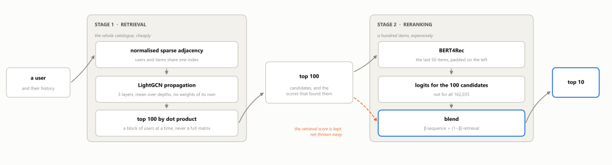
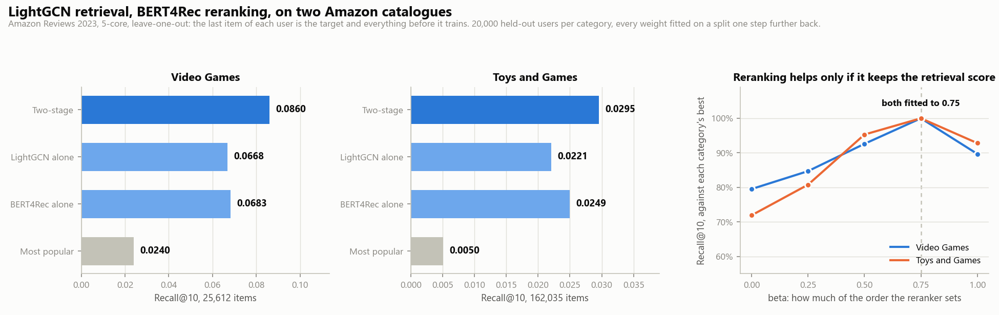

# Two-Stage Hybrid Recommender

[](https://github.com/no0e/two-stage-recommender/actions/workflows/tests.yml)
[](https://www.python.org/downloads/)
[](LICENSE)

Predicting the next item a user will touch. Retrieve a hundred candidates
cheaply, rerank ten of them with a sequence model.

Built for an in-class Kaggle competition on a private Amazon dataset, where it
finished first of eighty. This is the rewrite: it runs on public MovieLens data
and the whole thing is three commands.

## Try it

```bash
pip install -r requirements.txt
python scripts/fetch_data.py     # MovieLens 100k, 5 MB
python scripts/recommend.py      # ten films for one user, about two seconds
```

```
User 12, last five of 50 films watched
      Dances with Wolves (1990)
      Ghost (1990)
      Kolya (1996)
      Sleepless in Seattle (1993)
      Raising Arizona (1987)

Retrieval stage fitted in 0.9s.

Top 10, retrieval only
   1  Princess Bride, The (1987)
   2  When Harry Met Sally... (1989)  <- the one they watched
   3  Gandhi (1982)
   4  Quiz Show (1994)
   ...

They actually watched: When Harry Met Sally... (1989)
It lands in the top ten for about 18% of users; recall@10 over all 943 is 0.176.
```

The last film of every user is held out, so the answer is known and printed
underneath. `--user` picks another one, `--rerank` adds the second stage.

## What it does

<p align="center">
  
</p>

α and β are fitted on a split taken one step further back, with models that
never saw a test target. On MovieLens α came out at 1.0 — the content model
earns its place as the cold-start path rather than as part of the blend — and β
at 0.5. The Amazon runs retrieve with LightGCN alone and fitted β at 0.75 on
both categories.

**Retrieval** narrows 1,682 films to 100 candidates. EASE solves for an
item-item weight matrix in a single matrix inverse — no epochs, no learning
rate, about a second — and scores a user by their history weighted so recent
films count for more. LightGCN over the interaction graph is the alternative,
and a TF-IDF content model covers users and items with no history.

**Reranking** orders those 100 with BERT4Rec, a small transformer over the
user's sequence, blended with the retrieval score rather than replacing it.

## Results

<p align="center">
  
</p>

| | Recall@10 | NDCG@10 | Catalogue reached |
|---|---|---|---|
| Most popular | 0.079 | 0.039 | 5.4% |
| BERT4Rec alone | 0.125 | 0.064 | 73.1% |
| LightGCN alone | 0.132 | 0.069 | 40.0% |
| Recency EASE | 0.157 | 0.085 | 44.2% |
| **Two-stage** | **0.176** | **0.097** | 44.5% |

MovieLens 100k, leave-one-out: the last film of each of 943 users is held out
and everything before it trains. Margins are a paired bootstrap over users,
2000 resamples — two-stage beats popularity by +0.098 [+0.071, +0.125] and its
own best single stage by +0.019 [+0.004, +0.034].

Reproduce with `python scripts/evaluate.py`, which retrains everything and
rewrites the table and the figure. About four minutes on a GPU, half an hour on
a laptop CPU.

## At a larger scale

MovieLens has 1,682 items, which is small enough that a closed-form item-item
model is the best thing in this repository. Two public Amazon categories say
where that stops. Recall@10 over 20,000 held-out users:

| | Video_Games | Toys_and_Games |
|---|---|---|
| Items | 25,612 | 162,035 |
| Users | 94,762 | 432,264 |
| Interactions | 814,586 | 3,861,886 |
| Most popular | 0.0240 | 0.0050 |
| LightGCN alone | 0.0668 | 0.0221 |
| BERT4Rec alone | 0.0683 | 0.0249 |
| **LightGCN to BERT4Rec** | 0.0860 | **0.0295** |
| Recency EASE | **0.0893** | 391 GiB needed |

The closed form is not beaten, it is outgrown. Its matrix is the square of the
catalogue and the inverse needs a second one, so at 162,035 items it asks for
391 GiB on a 200 GiB machine. At 25,612 it still fits, in 197 seconds, and
still wins. That is the whole argument for the graph: not that it is more
accurate, but that it is still there at the next size.

Reranking earns its place at both: +0.0192 [+0.0160, +0.0223] over the graph
alone on Video_Games, +0.0075 [+0.0058, +0.0093] on Toys_and_Games. beta was
fitted separately on each and came out at 0.75 both times, with the same shape
either side — handing the reranker the whole order is worse than handing it
three quarters.

```bash
python scripts/evaluate_amazon.py --category Video_Games --with-ease
python scripts/evaluate_amazon.py --category Toys_and_Games
```

The data downloads itself. Four hours for the larger one on one 15 GB GPU, and
`docs/amazon_*.json` holds what each run measured.

## Layout

```
recsys/data.py       loading, the split, the padding-safe index
recsys/models.py     content, EASE, LightGCN, BERT4Rec
recsys/pipeline.py   the two stages joined, and the baselines
recsys/metrics.py    recall, NDCG, coverage, paired bootstrap
recsys/amazon.py     the larger catalogues, and prefixes without copies
recsys/large.py      blocked retrieval, candidate-only reranking
scripts/             fetch_data, recommend, evaluate, evaluate_amazon
tests/               40 tests, no dataset or GPU needed
notebooks/           the competition notebook, as it was run
```

`torch_geometric` is not a dependency — LightGCN propagation is one normalised
sparse matrix multiply per layer.

Nothing in the large path builds a users-by-items array. Retrieval multiplies a
block of users against the item table and takes the top hundred before the
block is released; reranking scores those hundred columns rather than all
162,035, and training samples its softmax for the same reason.

On Windows, set `OMP_NUM_THREADS=1` first: some BLAS builds deadlock on matrix
inversions larger than about 800 by 800, which the item-item matrix is.

## Licence

MIT, see [LICENSE](LICENSE). MovieLens belongs to GroupLens and carries its own
terms.
